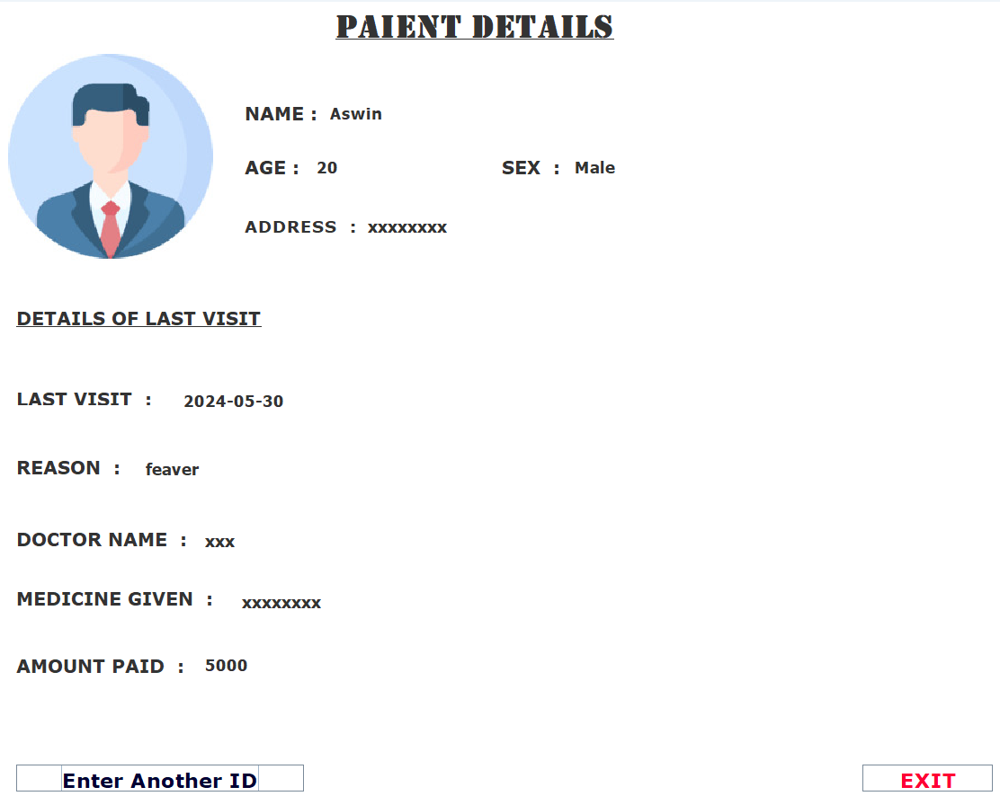

# 🏥 Hospital Management System

## 📌 Overview
The **Hospital Management System** is a Java-based desktop application built to efficiently manage and retrieve patient details through a simple and intuitive interface. Users can log in using a patient ID to view comprehensive records including personal information, last visit history, and billing data.

## ✨ Features
- **🔐 Login Page**: Enter a patient ID to access their details.
- **📋 Patient Details Interface**: View complete patient records:
  - Name, Age, Sex, Address
  - Last Visit Date, Reason for Visit
  - Doctor Name, Prescribed Medicines
  - Billing: Amount Paid
- **🔄 Navigation**:
  - Easily look up another patient
  - Exit the application with a click

## 🛠️ Technologies Used
- **Java Swing** — GUI development
- **MySQL** — Database management
- **JDBC** — Database connectivity

## ✅ Prerequisites
- Java Development Kit (JDK) 8 or higher
- MySQL Server
- MySQL JDBC Driver

## 🚀 Setup Instructions

1. **Clone the Repository**  
   ```bash
   git clone https://github.com/your-username/hospital-management-system.git
   ```

2. **Open the Project**  
   Use any Java IDE (e.g., **Eclipse**, **IntelliJ IDEA**, or **VS Code**).

3. **Configure the MySQL Database**  
   - Create a database named `Hospital`
   - Run the following SQL to create the required table:
     ```sql
     CREATE TABLE hospital (
         Id VARCHAR(255) PRIMARY KEY,
         Name VARCHAR(255),
         Age INT,
         Sex VARCHAR(10),
         Address VARCHAR(255),
         LastVisit DATE,
         Reason VARCHAR(255),
         DoctorName VARCHAR(255),
         MedicineGiven VARCHAR(255),
         AmountPaid DECIMAL(10, 2)
     );
     ```
   - Insert sample records for testing.

4. **Update the Database Credentials**  
   In `Loginpage.java`, update the MySQL connection line:
   ```java
   Connection con = DriverManager.getConnection(
       "jdbc:mysql://localhost:3306/Hospital?useSSL=false&allowPublicKeyRetrieval=true",
       "yourUsername", "yourPassword"
   );
   ```

5. **Run the Application**  
   Execute the `Loginpage` class to start the application.

## 🧭 How to Use
1. Launch the application by running the `Loginpage` class.
2. Enter a **valid patient ID** and click **"Submit"**.
3. View the complete patient details.
4. Use **"Enter Another ID"** to search for another patient, or click **"Exit"** to close the app.

## 📸 Screenshots

### 🔑 Login Page  


### 📄 Patient Details Page  


> 📁 Ensure the `screenshots/` directory contains the image files named `login.png` and `patient_details.png`.

## 🚧 Future Enhancements
- 🔐 Add secure user authentication and role-based access.
- 📅 Implement appointment scheduling and reminders.
- 🩺 Track patient medical history and reports.
- 🎨 Enhance the UI/UX for a modern and responsive design.
- 📊 Add analytics for patient visits and billing.

---

> ⚠️ *This is a student project for learning purposes. Not intended for real-world clinical use.*
